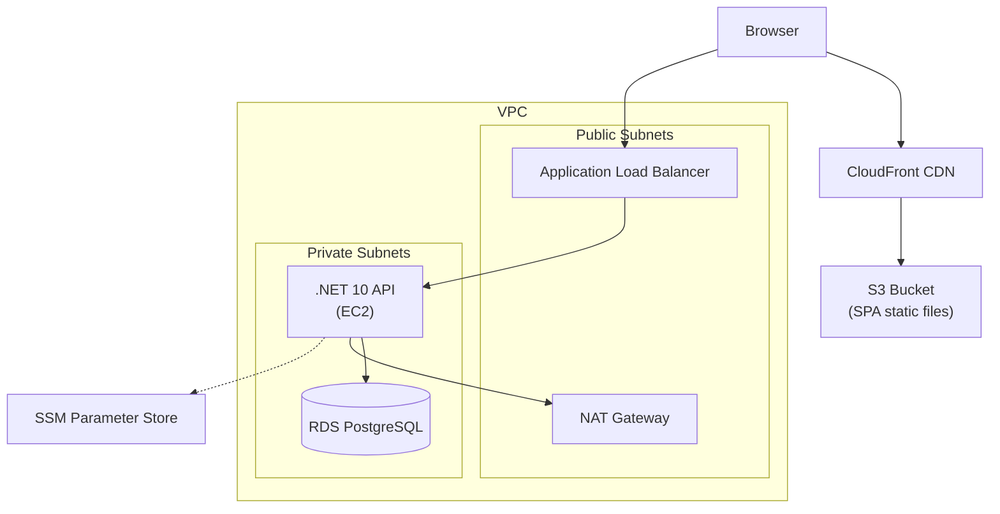

# AWS Best Practices Deployment Tutorial for WaniKani Relearn

This guide explains how to deploy the WaniKani Relearn application to AWS using an enterprise-grade architecture. We will use managed services properly without relying on Kubernetes or containers.

> [!NOTE]
> This guide is designed for a completely containerless architecture. The .NET API will run directly on an EC2 instance behind an Application Load Balancer, and the React frontend will be served as a static SPA via S3 and CloudFront.

## 1. Architecture Overview



## 2. Comparison: Classic vs Best Practices

| Feature | Classic (Single EC2) | Best Practices (This Guide) |
| :--- | :--- | :--- |
| **Frontend Serving** | Node.js/Nginx on EC2 | S3 + CloudFront (CDN) |
| **Backend Compute** | Same EC2 instance | Dedicated EC2 in Private Subnet |
| **Database** | Postgres on EC2 | RDS PostgreSQL (Managed) |
| **Secrets** | `.env` files | SSM Parameter Store |
| **Security** | Public IP, open ports | Private subnets, strict Security Groups |
| **Load Balancing** | Direct to instance | Application Load Balancer (ALB) |
| **Scaling** | Vertical only | Ready for Auto Scaling Groups |

## 3. Prerequisites & AWS CLI Setup

1. Install the AWS CLI and configure it:
   ```bash
   aws configure
   ```
2. Set your default region (e.g., `us-east-1`):
   ```bash
   export AWS_REGION=us-east-1
   ```

## 4. VPC Networking Setup

We need a VPC with 2 public subnets and 2 private subnets across two Availability Zones for high availability.

> [!IMPORTANT]
> The exact AWS CLI commands to create VPCs, subnets, route tables, Internet Gateways, and NAT Gateways are quite lengthy. In a real-world scenario, you would use AWS CDK, CloudFormation, or Terraform for this. For this tutorial, assume you have a VPC created with the standard public/private subnet pattern.

Let's assign the IDs to environment variables to use in subsequent commands:

```bash
export VPC_ID="vpc-xxxxxxxxxxxxxxxxx"
export PUB_SUBNET_1="subnet-xxxxxxxxxxxxxxxxx"
export PUB_SUBNET_2="subnet-xxxxxxxxxxxxxxxxx"
export PRIV_SUBNET_1="subnet-xxxxxxxxxxxxxxxxx"
export PRIV_SUBNET_2="subnet-xxxxxxxxxxxxxxxxx"
```

## 5. Security Groups

Create strict security groups.

**ALB Security Group** (Allows HTTP from anywhere):
```bash
ALB_SG_ID=$(aws ec2 create-security-group \
    --group-name WaniKaniALB-SG \
    --description "Allow HTTP traffic to ALB" \
    --vpc-id $VPC_ID --query 'GroupId' --output text)

aws ec2 authorize-security-group-ingress \
    --group-id $ALB_SG_ID \
    --protocol tcp --port 80 --cidr 0.0.0.0/0
```

**EC2 Security Group** (Allows HTTP only from ALB):
```bash
EC2_SG_ID=$(aws ec2 create-security-group \
    --group-name WaniKaniAPI-SG \
    --description "Allow traffic from ALB only" \
    --vpc-id $VPC_ID --query 'GroupId' --output text)

aws ec2 authorize-security-group-ingress \
    --group-id $EC2_SG_ID \
    --protocol tcp --port 5000 --source-group $ALB_SG_ID
```

**RDS Security Group** (Allows Postgres only from EC2):
```bash
RDS_SG_ID=$(aws ec2 create-security-group \
    --group-name WaniKaniDB-SG \
    --description "Allow Postgres traffic from EC2" \
    --vpc-id $VPC_ID --query 'GroupId' --output text)

aws ec2 authorize-security-group-ingress \
    --group-id $RDS_SG_ID \
    --protocol tcp --port 5432 --source-group $EC2_SG_ID
```

## 6. RDS PostgreSQL

Create a DB subnet group containing your private subnets, then launch the RDS instance.

```bash
aws rds create-db-subnet-group \
    --db-subnet-group-name wanikani-subnet-group \
    --db-subnet-group-description "Private subnets for RDS" \
    --subnet-ids $PRIV_SUBNET_1 $PRIV_SUBNET_2

aws rds create-db-instance \
    --db-instance-identifier wanikani-db \
    --db-instance-class db.t3.micro \
    --engine postgres \
    --master-username postgres \
    --master-user-password YourSecureDbPassword123! \
    --allocated-storage 20 \
    --vpc-security-group-ids $RDS_SG_ID \
    --db-subnet-group-name wanikani-subnet-group \
    --no-publicly-accessible
```

## 7. IAM Role for EC2

The EC2 instance needs permission to read parameters from SSM and be managed via SSM Session Manager (so we can SSH without a bastion host).

```bash
# Create trust policy
cat > trust-policy.json << EOF
{
  "Version": "2012-10-17",
  "Statement": [
    {
      "Effect": "Allow",
      "Principal": { "Service": "ec2.amazonaws.com" },
      "Action": "sts:AssumeRole"
    }
  ]
}
EOF

aws iam create-role --role-name WaniKaniApiRole --assume-role-policy-document file://trust-policy.json
aws iam attach-role-policy --role-name WaniKaniApiRole --policy-arn arn:aws:iam::aws:policy/AmazonSSMManagedInstanceCore
aws iam create-instance-profile --instance-profile-name WaniKaniApiProfile
aws iam add-role-to-instance-profile --instance-profile-name WaniKaniApiProfile --role-name WaniKaniApiRole

# Allow access to SSM Parameters
cat > ssm-policy.json << EOF
{
  "Version": "2012-10-17",
  "Statement": [
    {
      "Effect": "Allow",
      "Action": ["ssm:GetParameters", "ssm:GetParameter"],
      "Resource": "arn:aws:ssm:*:*:parameter/wanikani/*"
    }
  ]
}
EOF
aws iam put-role-policy --role-name WaniKaniApiRole --policy-name SSMReadAccess --policy-document file://ssm-policy.json
```

## 8. Store Secrets in SSM

Store the sensitive environment variables securely.

```bash
aws ssm put-parameter --name "/wanikani/db_password" --value "YourSecureDbPassword123!" --type "SecureString"
aws ssm put-parameter --name "/wanikani/api_token" --value "your_wanikani_personal_access_token" --type "SecureString"
```

## 9. Launch EC2 Instance

Launch an Amazon Linux 2023 instance in the private subnet. It will run the .NET runtime and our application.

```bash
AMI_ID=$(aws ssm get-parameters --names /aws/service/ami-amazon-linux-latest/al2023-ami-kernel-6.1-x86_64 --query 'Parameters[0].Value' --output text)

cat > user-data.sh << 'EOF'
#!/bin/bash
dnf update -y
dnf install -y dotnet-runtime-10.0 aspnetcore-runtime-10.0 jq
EOF

INSTANCE_ID=$(aws ec2 run-instances \
    --image-id $AMI_ID \
    --count 1 \
    --instance-type t3.micro \
    --security-group-ids $EC2_SG_ID \
    --subnet-id $PRIV_SUBNET_1 \
    --iam-instance-profile Name=WaniKaniApiProfile \
    --user-data file://user-data.sh \
    --query 'Instances[0].InstanceId' \
    --output text)
```

## 10. Application Load Balancer

Create the ALB in the public subnets to route traffic to the EC2 instance.

```bash
ALB_ARN=$(aws elbv2 create-load-balancer \
    --name wanikani-alb \
    --subnets $PUB_SUBNET_1 $PUB_SUBNET_2 \
    --security-groups $ALB_SG_ID \
    --query 'LoadBalancers[0].LoadBalancerArn' \
    --output text)

TG_ARN=$(aws elbv2 create-target-group \
    --name wanikani-tg \
    --protocol HTTP \
    --port 5000 \
    --vpc-id $VPC_ID \
    --target-type instance \
    --query 'TargetGroups[0].TargetGroupArn' \
    --output text)

aws elbv2 register-targets \
    --target-group-arn $TG_ARN \
    --targets Id=$INSTANCE_ID

aws elbv2 create-listener \
    --load-balancer-arn $ALB_ARN \
    --protocol HTTP \
    --port 80 \
    --default-actions Type=forward,TargetGroupArn=$TG_ARN

ALB_DNS=$(aws elbv2 describe-load-balancers --load-balancer-arns $ALB_ARN --query 'LoadBalancers[0].DNSName' --output text)
echo "API URL: http://$ALB_DNS"
```

## 11. Deploy Backend (API)

Build the API locally and transfer it via S3 or directly.

```bash
cd /Users/romanbodnar/code/wanikani-relearn/WaniKani.Relearn/
dotnet publish -c Release -o ./publish
```

Zip the contents, upload to an S3 bucket, and download it on the EC2 instance (accessed via SSM Session Manager). Create a standard `systemd` service for the API.

> [!TIP]
> Use `aws ssm start-session --target $INSTANCE_ID` to open a terminal to your private EC2 instance!

Example `systemd` service (`/etc/systemd/system/wanikani-api.service`):

```ini
[Unit]
Description=WaniKani Relearn API
After=network.target

[Service]
WorkingDirectory=/opt/wanikani-api
ExecStart=/usr/bin/dotnet /opt/wanikani-api/WaniKani.Relearn.dll
Restart=always
RestartSec=10
SyslogIdentifier=wanikani-api
User=ec2-user
Environment=ASPNETCORE_ENVIRONMENT=Production
Environment=ASPNETCORE_URLS=http://*:5000
Environment=ConnectionStrings__DefaultConnection="Host=wanikani-db.xxxxxxxxx.us-east-1.rds.amazonaws.com;Database=wanikanidb;Username=postgres;"

[Install]
WantedBy=multi-user.target
```

To fetch secrets at runtime securely without putting them in the systemd file, your .NET app should be configured to read from AWS Systems Manager directly using `Amazon.Extensions.Configuration.SystemsManager`, or via a wrapper script that fetches them and exports them as environment variables before starting `dotnet`.

## 12. Deploy Frontend (S3 + CloudFront)

Since the React Router app has SSR disabled, it's a pure SPA.

1. Build the frontend:
```bash
cd /Users/romanbodnar/code/wanikani-relearn/WaniKani.Relearn.FE/
export VITE_API_URL="http://$ALB_DNS"
npm run build
```

2. Create an S3 bucket and upload the files:
```bash
BUCKET_NAME="wanikani-frontend-$(date +%s)"
aws s3 mb s3://$BUCKET_NAME
aws s3 sync build/client s3://$BUCKET_NAME
```

3. Create a CloudFront Distribution:
Create a CloudFront Origin Access Control (OAC) to allow CloudFront to read the private S3 bucket, and set up the distribution.
For SPAs, it's crucial to set up **Custom Error Responses** in CloudFront to redirect `404 Not Found` and `403 Forbidden` to `/index.html` with a `200 OK` response code, so React Router can handle the client-side routing.

## 13. Verification

1. Backend: Visit `http://$ALB_DNS/health` (or your health check endpoint)
2. Frontend: Visit your CloudFront domain name (e.g., `https://dxxxxxx.cloudfront.net`)

## 14. Cost Estimate

| Service | Component | Monthly Cost (Approx) |
| :--- | :--- | :--- |
| ALB | Load Balancer (Base + LCU) | $20.00 |
| EC2 | t3.micro (Linux) | $7.60 |
| RDS | db.t3.micro (Single-AZ) | $13.00 |
| NAT Gateway | 1 NAT Gateway | $32.00 |
| S3 + CloudFront | Storage and Transfer | ~$1.00 |
| **Total** | | **~$73.60** |

> [!TIP]
> To reduce costs for side projects, you can remove the NAT Gateway and place the EC2 instance in a public subnet. However, this deviates from the enterprise best-practices architecture.

## 15. Teardown Instructions

To avoid ongoing charges:
1. Delete CloudFront distribution
2. Empty and delete S3 bucket
3. Delete ALB and Target Group
4. Terminate EC2 instance
5. Delete RDS instance
6. Delete NAT Gateways, Elastic IPs, and VPC structure.
