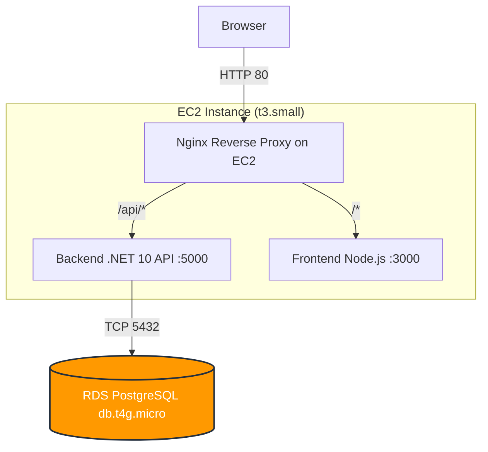

# Deploying WaniKani Relearn to AWS (Classic EC2/RDS)

This tutorial walks you through deploying the WaniKani Relearn application to AWS using a classic virtual machine approach. We will provision an EC2 instance to host the .NET backend and React Router frontend, and an RDS instance for the PostgreSQL database.

## Architecture



> [!IMPORTANT]
> This deployment uses HTTP only, as requested. The public DNS of the EC2 instance will be used as the endpoint.

## 1. Prerequisites & AWS CLI Setup

Ensure you have the AWS CLI installed and configured.

```bash
# Verify installation
aws --version

# Configure credentials if you haven't already
aws configure
# (Enter Access Key, Secret Key, default region like us-east-1, and output format json)

# Set some useful environment variables for the deployment
REGION="us-east-1"
DB_PASSWORD="YourSecureDbPassword123!" # Change this!
```

## 2. Security Groups

We need security groups for both EC2 and RDS.

```bash
# Get default VPC ID
VPC_ID=$(aws ec2 describe-vpcs --filters Name=isDefault,Values=true --query "Vpcs[0].VpcId" --output text)

# Create EC2 Security Group
EC2_SG_ID=$(aws ec2 create-security-group \
    --group-name wanikani-ec2-sg \
    --description "SG for WaniKani Relearn EC2" \
    --vpc-id $VPC_ID \
    --query "GroupId" --output text)

# Allow SSH (22) and HTTP (80)
aws ec2 authorize-security-group-ingress --group-id $EC2_SG_ID --protocol tcp --port 22 --cidr 0.0.0.0/0
aws ec2 authorize-security-group-ingress --group-id $EC2_SG_ID --protocol tcp --port 80 --cidr 0.0.0.0/0

# Create RDS Security Group
RDS_SG_ID=$(aws ec2 create-security-group \
    --group-name wanikani-rds-sg \
    --description "SG for WaniKani Relearn RDS" \
    --vpc-id $VPC_ID \
    --query "GroupId" --output text)

# Allow PostgreSQL (5432) access ONLY from the EC2 Security Group
aws ec2 authorize-security-group-ingress \
    --group-id $RDS_SG_ID \
    --protocol tcp \
    --port 5432 \
    --source-group $EC2_SG_ID
```

## 3. RDS PostgreSQL Provisioning

Create a cheap db.t4g.micro PostgreSQL instance.

```bash
aws rds create-db-instance \
    --db-instance-identifier wanikani-db \
    --db-instance-class db.t4g.micro \
    --engine postgres \
    --master-username wanikani_admin \
    --master-user-password "$DB_PASSWORD" \
    --allocated-storage 20 \
    --vpc-security-group-ids $RDS_SG_ID \
    --publicly-accessible \
    --no-multi-az \
    --storage-type gp3

# Wait for it to become available (this takes ~5-10 minutes)
aws rds wait db-instance-available --db-instance-identifier wanikani-db

# Get the endpoint
RDS_ENDPOINT=$(aws rds describe-db-instances \
    --db-instance-identifier wanikani-db \
    --query "DBInstances[0].Endpoint.Address" \
    --output text)
echo "RDS Endpoint: $RDS_ENDPOINT"
```

## 4. EC2 Instance Provisioning

We'll use Ubuntu 24.04 LTS on a t3.small instance (t3.micro might struggle with both Node and .NET + Nginx).

```bash
# Create an SSH key pair
aws ec2 create-key-pair --key-name wanikani-key --query "KeyMaterial" --output text > wanikani-key.pem
chmod 400 wanikani-key.pem

# Get Ubuntu 24.04 AMI ID for region
AMI_ID=$(aws ec2 describe-images \
    --owners 099720109477 \
    --filters "Name=name,Values=ubuntu/images/hvm-ssd-gp3/ubuntu-noble-24.04-amd64-server-*" "Name=state,Values=available" \
    --query "sort_by(Images, &CreationDate)[-1].ImageId" \
    --output text)

# Launch EC2 instance
INSTANCE_ID=$(aws ec2 run-instances \
    --image-id $AMI_ID \
    --count 1 \
    --instance-type t3.small \
    --key-name wanikani-key \
    --security-group-ids $EC2_SG_ID \
    --tag-specifications 'ResourceType=instance,Tags=[{Key=Name,Value=wanikani-server}]' \
    --query "Instances[0].InstanceId" \
    --output text)

# Wait for instance to run
aws ec2 wait instance-running --instance-ids $INSTANCE_ID

# Get Public DNS
EC2_DNS=$(aws ec2 describe-instances \
    --instance-ids $INSTANCE_ID \
    --query "Reservations[0].Instances[0].PublicDnsName" \
    --output text)
echo "EC2 Public DNS: $EC2_DNS"
```

## 5. Install Runtimes on EC2

SSH into your new instance:

```bash
ssh -i wanikani-key.pem ubuntu@$EC2_DNS
```

Run these commands on the server to install .NET 10, Node.js 22, and Nginx:

```bash
# Update system
sudo apt update && sudo apt upgrade -y

# Install Nginx and PostgreSQL client
sudo apt install -y nginx postgresql-client

# Install Node.js 22
curl -fsSL https://deb.nodesource.com/setup_22.x | sudo -E bash -
sudo apt install -y nodejs

# Install .NET 10 (Using Microsoft package repository)
wget https://packages.microsoft.com/config/ubuntu/24.04/packages-microsoft-prod.deb -O packages-microsoft-prod.deb
sudo dpkg -i packages-microsoft-prod.deb
rm packages-microsoft-prod.deb
sudo apt update
sudo apt install -y dotnet-sdk-10.0
```

### Initialize Database
Before deploying code, let's create the database and apply the schema using the RDS endpoint from earlier. Replace `<RDS_ENDPOINT>` with your actual endpoint.

```bash
# On your local machine, run:
psql -h <RDS_ENDPOINT> -U wanikani_admin -d postgres -c "CREATE DATABASE wanikani;"

# Apply schema
psql -h <RDS_ENDPOINT> -U wanikani_admin -d wanikani -f /Users/romanbodnar/code/wanikani-relearn/WaniKani.Relearn/Data/SqlScripts/schema.sql

# Apply seed data
psql -h <RDS_ENDPOINT> -U wanikani_admin -d wanikani -f /Users/romanbodnar/code/wanikani-relearn/WaniKani.Relearn/Data/SqlScripts/seed_data.sql
```
*(Enter the RDS password when prompted)*

## 6. Code Changes Required

Before building, we need to modify the code to support HTTP-only operation without a domain.

### Backend (`Program.cs`)
Since we are using HTTP only, we must change cookie policies and remove HTTPS redirection.

```csharp
// 1. Remove or comment out:
// app.UseHttpsRedirection();

// 2. Change cookie policy from Always to SameAsRequest:
// In the auth configuration:
options.Cookie.SecurePolicy = CookieSecurePolicy.SameAsRequest;
```

### CORS Configuration
Ensure your API allows requests from the EC2 Public DNS. 
Update `AllowedCorsOrigins` in `appsettings.json` or configure it in `Program.cs` to include `http://<YOUR_EC2_DNS>`.

## 7. Deploy Backend

On your local machine:

```bash
# Build
cd /Users/romanbodnar/code/wanikani-relearn/WaniKani.Relearn/
dotnet publish -c Release -o ./publish

# Transfer files
rsync -avz -e "ssh -i ../wanikani-key.pem" ./publish/ ubuntu@$EC2_DNS:~/backend/
```

On the EC2 server, create a systemd service:

```bash
sudo nano /etc/systemd/system/wanikani-api.service
```

```ini
[Unit]
Description=WaniKani Relearn .NET 10 API
After=network.target

[Service]
WorkingDirectory=/home/ubuntu/backend
ExecStart=/usr/bin/dotnet /home/ubuntu/backend/WaniKani.Relearn.dll
Restart=always
RestartSec=10
SyslogIdentifier=wanikani-api
User=ubuntu
Environment=ASPNETCORE_ENVIRONMENT=Production
Environment=ASPNETCORE_URLS=http://127.0.0.1:5000
Environment=ConnectionStrings__DefaultConnection="Host=<RDS_ENDPOINT>;Database=wanikani;Username=wanikani_admin;"
Environment=DB_PASSWORD="YourSecureDbPassword123!"
Environment=WaniKani__AccessToken="your_wk_token"
Environment=WaniKani__Api="https://api.wanikani.com/v2/"
Environment=WaniKani__Revision="20170710"

[Install]
WantedBy=multi-user.target
```

```bash
sudo systemctl enable wanikani-api
sudo systemctl start wanikani-api
sudo systemctl status wanikani-api # Verify it's running
```

## 8. Deploy Frontend

On your local machine, build the React Router app. We must inject the API URL at build time.

```bash
cd /Users/romanbodnar/code/wanikani-relearn/WaniKani.Relearn.FE/
# Set the API URL to the public DNS
export VITE_API_URL="http://$EC2_DNS/api"
npm install
npm run build

# Transfer files
rsync -avz -e "ssh -i ../wanikani-key.pem" ./build/ ubuntu@$EC2_DNS:~/frontend/
```

On the EC2 server, install the server globally and create a systemd service:

```bash
sudo npm install -g @react-router/serve
sudo nano /etc/systemd/system/wanikani-fe.service
```

```ini
[Unit]
Description=WaniKani Relearn React Router Frontend
After=network.target

[Service]
WorkingDirectory=/home/ubuntu/frontend
ExecStart=/usr/bin/react-router-serve ./server/index.js
Restart=always
RestartSec=10
SyslogIdentifier=wanikani-fe
User=ubuntu
Environment=NODE_ENV=production
Environment=PORT=3000

[Install]
WantedBy=multi-user.target
```

```bash
sudo systemctl enable wanikani-fe
sudo systemctl start wanikani-fe
```

## 9. Nginx Reverse Proxy Config

Configure Nginx to route traffic to your background services. On the EC2 server:

```bash
sudo nano /etc/nginx/sites-available/wanikani
```

```nginx
server {
    listen 80;
    server_name _; # Catch-all

    # Frontend routes
    location / {
        proxy_pass http://127.0.0.1:3000;
        proxy_http_version 1.1;
        proxy_set_header Upgrade $http_upgrade;
        proxy_set_header Connection 'upgrade';
        proxy_set_header Host $host;
        proxy_cache_bypass $http_upgrade;
    }

    # Backend API routes
    location /api/ {
        proxy_pass http://127.0.0.1:5000/; # Note the trailing slash if rewriting, or keep it depending on .NET routing
        proxy_http_version 1.1;
        proxy_set_header Upgrade $http_upgrade;
        proxy_set_header Connection keep-alive;
        proxy_set_header Host $host;
        proxy_cache_bypass $http_upgrade;
        proxy_set_header X-Forwarded-For $proxy_add_x_forwarded_for;
        proxy_set_header X-Forwarded-Proto $scheme;
    }
}
```
*(Note: If your API routes start with `/api`, remove the trailing slash on `proxy_pass`. If Nginx needs to strip `/api`, keep it.)*

Enable the site:

```bash
sudo ln -s /etc/nginx/sites-available/wanikani /etc/nginx/sites-enabled/
sudo rm /etc/nginx/sites-enabled/default
sudo nginx -t
sudo systemctl reload nginx
```

## 10. Verification & Troubleshooting

Open `http://<EC2_DNS>` in your browser. 

If things aren't working:
1. **Check Backend logs**: `sudo journalctl -u wanikani-api -f`
2. **Check Frontend logs**: `sudo journalctl -u wanikani-fe -f`
3. **Check Nginx logs**: `sudo tail -f /var/log/nginx/error.log`

> [!TIP]
> If you get 502 Bad Gateway on `/api/`, verify the `.NET` application started successfully on port 5000. 

## 11. Redeployment Workflow

When you make changes to code, you just need to build, sync, and restart the service.

**For Backend:**
```bash
dotnet publish -c Release -o ./publish
rsync -avz -e "ssh -i wanikani-key.pem" ./publish/ ubuntu@$EC2_DNS:~/backend/
ssh -i wanikani-key.pem ubuntu@$EC2_DNS "sudo systemctl restart wanikani-api"
```

**For Frontend:**
```bash
export VITE_API_URL="http://$EC2_DNS/api"
npm run build
rsync -avz -e "ssh -i wanikani-key.pem" ./build/ ubuntu@$EC2_DNS:~/frontend/
ssh -i wanikani-key.pem ubuntu@$EC2_DNS "sudo systemctl restart wanikani-fe"
```

## 12. Estimated Monthly Costs

| Service | Instance Type | Details | Est. Monthly Cost |
|---------|---------------|---------|-------------------|
| **EC2** | t3.small | 2 vCPU, 2GB RAM. Base OS + apps. | ~$15.00 |
| **EBS** | gp3 8GB | EC2 Root volume | ~$0.64 |
| **RDS** | db.t4g.micro | 2 vCPU, 1GB RAM. PostgreSQL. | ~$13.00 |
| **Storage**| gp3 20GB | RDS Data volume | ~$2.30 |
| **Data Xfer**| Outbound | Standard rates | ~$0.50 (low traffic) |
| **Total** | | | **~$31.44 / month** |

*Note: Pricing depends on the region. The t4g.micro RDS may be covered under AWS free tier if your account is eligible.*

## 13. Teardown Instructions

To avoid incurring charges, destroy the resources when done.

```bash
# 1. Delete RDS Instance
aws rds delete-db-instance \
    --db-instance-identifier wanikani-db \
    --skip-final-snapshot

# 2. Terminate EC2 Instance
aws ec2 terminate-instances --instance-ids $INSTANCE_ID

# 3. Wait for resources to be deleted before removing SGs
# (Takes about 5 minutes for RDS, 2 mins for EC2)

# 4. Delete Security Groups
aws ec2 delete-security-group --group-id $RDS_SG_ID
aws ec2 delete-security-group --group-id $EC2_SG_ID
```
