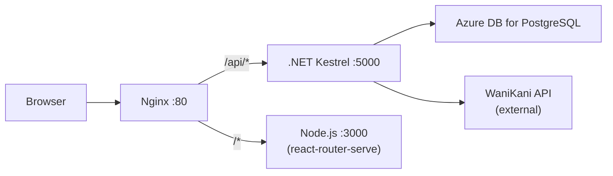

# Deploying WaniKani Relearn to Azure (Classic VM Mode)

A step-by-step guide to deploying the full application — .NET 10 backend API + React Router SPA frontend — onto an **Azure Linux VM** with **Azure Database for PostgreSQL**, using **Nginx** as a reverse proxy and **systemd** for process management. No Docker, no Kubernetes.

---

## Architecture Overview



| Component | Azure Service |
|---|---|
| Compute | Azure VM (Ubuntu 24.04 LTS) |
| Database | Azure Database for PostgreSQL – Flexible Server |
| Reverse proxy | Nginx (HTTP only — no domain needed) |

---

## Prerequisites

- An Azure account with an active subscription
- Azure CLI installed locally (`brew install azure-cli`)
- Your WaniKani API access token

---

## Step 1 — Install and Log In to Azure CLI

```bash
# Install (macOS)
brew install azure-cli

# Log in
az login

# Set your subscription (if you have multiple)
az account set --subscription "<YOUR_SUBSCRIPTION_ID>"
```

---

## Step 2 — Create a Resource Group

A resource group is a logical container for all related Azure resources.

```bash
az group create \
  --name rg-bonpom \
  --location westeurope
```

> [!TIP]
> Use `az account list-locations -o table` to see all available regions. Pick one close to your users.

---

## Step 3 — Create Azure Database for PostgreSQL (Flexible Server)

### 3.1 — Create the server

```bash
az postgres flexible-server create \
  --resource-group rg-bonpom \
  --name bonpom-pgserver \
  --location westeurope \
  --admin-user bonpomadmin \
  --admin-password '<STRONG_PASSWORD_HERE>' \
  --sku-name Standard_B1ms \
  --tier Burstable \
  --storage-size 32 \
  --version 16 \
  --public-access 0.0.0.0 \
  --yes
```

> [!IMPORTANT]
> Save the admin password securely — you'll need it for the connection string.

| Parameter | Why |
|---|---|
| `Standard_B1ms` | Cheapest burstable tier (~\$13/mo), 1 vCore, 2 GB RAM — fine for a personal project |
| `--version 16` | PostgreSQL 16, well supported by Npgsql |
| `--public-access 0.0.0.0` | Allows firewall rules to be added (we'll restrict to the VM's IP) |

### 3.2 — Create the database

```bash
az postgres flexible-server db create \
  --resource-group rg-bonpom \
  --server-name bonpom-pgserver \
  --database-name bonpom
```

### 3.3 — Add a firewall rule for your local machine (for initial schema setup)

```bash
MY_IP=$(curl -s ifconfig.me)
az postgres flexible-server firewall-rule create \
  --resource-group rg-bonpom \
  --name bonpom-pgserver \
  --rule-name allow-my-ip \
  --start-ip-address "$MY_IP" \
  --end-ip-address "$MY_IP"
```

### 3.4 — Apply the schema

Connect with `psql` and run your existing [schema.sql](file:///Users/romanbodnar/code/wanikani-relearn/WaniKani.Relearn/Data/SqlScripts/schema.sql):

```bash
psql "host=bonpom-pgserver.postgres.database.azure.com \
  port=5432 \
  dbname=bonpom \
  user=bonpomadmin \
  sslmode=require" \
  -f WaniKani.Relearn/Data/SqlScripts/schema.sql
```

Then apply the seed data if you have it:

```bash
psql "host=bonpom-pgserver.postgres.database.azure.com \
  port=5432 \
  dbname=bonpom \
  user=bonpomadmin \
  sslmode=require" \
  -f WaniKani.Relearn/Data/SqlScripts/seed_data.sql
```

> [!NOTE]
> The connection string format for Azure PostgreSQL always uses the server's FQDN: `bonpom-pgserver.postgres.database.azure.com`

---

## Step 4 — Create the Virtual Machine

### 4.1 — Create the VM

```bash
az vm create \
  --resource-group rg-bonpom \
  --name vm-bonpom \
  --image Ubuntu2404 \
  --size Standard_B2s \
  --admin-username azureuser \
  --generate-ssh-keys \
  --public-ip-sku Standard \
  --nsg-rule SSH
```

| Parameter | Why |
|---|---|
| `Standard_B2s` | 2 vCPUs, 4 GB RAM — enough for .NET + Node.js side by side (~\$30/mo) |
| `Ubuntu2404` | Ubuntu 24.04 LTS — good long-term support |

Save the `publicIpAddress` from the output — you'll use it to SSH in.

### 4.2 — Open the HTTP port

```bash
az vm open-port \
  --resource-group rg-bonpom \
  --name vm-bonpom \
  --port 80 \
  --priority 1001
```

### 4.3 — Add the VM's IP to the PostgreSQL firewall

```bash
VM_IP=$(az vm show -d -g rg-bonpom -n vm-bonpom --query publicIps -o tsv)
az postgres flexible-server firewall-rule create \
  --resource-group rg-bonpom \
  --name bonpom-pgserver \
  --rule-name allow-vm \
  --start-ip-address "$VM_IP" \
  --end-ip-address "$VM_IP"
```

---

## Step 5 — Set Up the VM

SSH into the machine:

```bash
ssh azureuser@<VM_PUBLIC_IP>
```

### 5.1 — Install .NET 10 SDK

```bash
# Register the Microsoft package repo
wget https://dot.net/v1/dotnet-install.sh -O dotnet-install.sh
chmod +x dotnet-install.sh

# Install .NET 10 (the target framework from your csproj)
./dotnet-install.sh --channel 10.0

# Add to PATH permanently
echo 'export DOTNET_ROOT=$HOME/.dotnet' >> ~/.bashrc
echo 'export PATH=$PATH:$DOTNET_ROOT:$DOTNET_ROOT/tools' >> ~/.bashrc
source ~/.bashrc

dotnet --version  # should print 10.x.x
```

### 5.2 — Install Node.js 22 LTS

```bash
curl -fsSL https://deb.nodesource.com/setup_22.x | sudo -E bash -
sudo apt-get install -y nodejs
node --version  # should print v22.x.x
npm --version
```

### 5.3 — Install Nginx

```bash
sudo apt-get update
sudo apt-get install -y nginx
sudo systemctl enable nginx
```

---

## Step 6 — Deploy the Backend (.NET API)

### 6.1 — Build and publish locally

On your **local machine**, publish a release build:

```bash
cd WaniKani.Relearn
dotnet publish -c Release -o ./publish
```

### 6.2 — Copy to the VM

```bash
# From your local machine
rsync -avz --progress ./publish/ azureuser@<VM_PUBLIC_IP>:/home/azureuser/bonpom-api/
```

Also copy the context sentences data file if needed:

```bash
scp context-sentences-processed.json azureuser@<VM_PUBLIC_IP>:/home/azureuser/bonpom-api/
```

### 6.3 — Create the systemd service

On the **VM**, create `/etc/systemd/system/bonpom-api.service`:

```bash
sudo tee /etc/systemd/system/bonpom-api.service > /dev/null << 'EOF'
[Unit]
Description=Bonpom API (.NET)
After=network.target

[Service]
WorkingDirectory=/home/azureuser/bonpom-api
ExecStart=/home/azureuser/.dotnet/dotnet /home/azureuser/bonpom-api/WaniKani.Relearn.dll
Restart=always
RestartSec=10
SyslogIdentifier=bonpom-api
User=azureuser
Environment=ASPNETCORE_ENVIRONMENT=Production
Environment=ASPNETCORE_URLS=http://localhost:5000
Environment=ConnectionStrings__DefaultConnection=Host=bonpom-pgserver.postgres.database.azure.com;Port=5432;Database=bonpom;Username=bonpomadmin;SSL Mode=Require;Trust Server Certificate=true
Environment=DB_PASSWORD=<YOUR_DB_PASSWORD>
Environment=WaniKani__AccessToken=<YOUR_WANIKANI_TOKEN>
Environment=WaniKani__Api=https://api.wanikani.com/v2/
Environment=WaniKani__Revision=20170710
Environment=AllowedCorsOrigins__0=http://<VM_PUBLIC_IP>

[Install]
WantedBy=multi-user.target
EOF
```

> [!CAUTION]
> Replace `<YOUR_DB_PASSWORD>` and `<YOUR_WANIKANI_TOKEN>` with your actual secrets. For production hardening, consider using Azure Key Vault or storing secrets in a separate environment file with restricted permissions (`chmod 600`).

### 6.4 — Start the service

```bash
sudo systemctl daemon-reload
sudo systemctl enable bonpom-api
sudo systemctl start bonpom-api

# Check it's running
sudo systemctl status bonpom-api
curl http://localhost:5000/swagger/index.html  # Should return HTML
```

---

## Step 7 — Deploy the Frontend (React Router SPA)

### 7.1 — Build locally

On your **local machine**:

```bash
cd WaniKani.Relearn.FE

# Set the production API URL to the VM's public IP
echo "VITE_API_URL=http://<VM_PUBLIC_IP>" > .env.production

npm install
npm run build
```

> [!NOTE]
> Since [react-router.config.ts](file:///Users/romanbodnar/code/wanikani-relearn/WaniKani.Relearn.FE/react-router.config.ts) has `ssr: false`, this produces a static SPA build. However, `react-router-serve` is still used to serve it (for client-side routing fallback).

### 7.2 — Copy to the VM

```bash
rsync -avz --progress ./ azureuser@<VM_PUBLIC_IP>:/home/azureuser/bonpom-fe/ \
  --exclude node_modules --exclude .git
```

### 7.3 — Install dependencies on the VM

SSH into the VM:

```bash
cd /home/azureuser/bonpom-fe
npm install --omit=dev
```

### 7.4 — Create the systemd service

```bash
sudo tee /etc/systemd/system/bonpom-fe.service > /dev/null << 'EOF'
[Unit]
Description=Bonpom Frontend (React Router)
After=network.target

[Service]
WorkingDirectory=/home/azureuser/bonpom-fe
ExecStart=/usr/bin/node node_modules/@react-router/serve/bin.js ./build/server/index.js
Restart=always
RestartSec=10
SyslogIdentifier=bonpom-fe
User=azureuser
Environment=NODE_ENV=production
Environment=PORT=3000

[Install]
WantedBy=multi-user.target
EOF
```

### 7.5 — Start the service

```bash
sudo systemctl daemon-reload
sudo systemctl enable bonpom-fe
sudo systemctl start bonpom-fe

# Check it's running
sudo systemctl status bonpom-fe
curl http://localhost:3000  # Should return HTML
```

---

## Step 8 — Configure Nginx as Reverse Proxy

### 8.1 — Create the site config

```bash
sudo tee /etc/nginx/sites-available/bonpom > /dev/null << 'EOF'
server {
    listen 80;
    server_name _;

    # API backend — proxy /api, /swagger, /auth paths to .NET Kestrel
    location /api/ {
        proxy_pass http://127.0.0.1:5000;
        proxy_http_version 1.1;
        proxy_set_header Upgrade $http_upgrade;
        proxy_set_header Connection keep-alive;
        proxy_set_header Host $host;
        proxy_set_header X-Real-IP $remote_addr;
        proxy_set_header X-Forwarded-For $proxy_add_x_forwarded_for;
        proxy_set_header X-Forwarded-Proto $scheme;
        proxy_cache_bypass $http_upgrade;
    }

    location /swagger {
        proxy_pass http://127.0.0.1:5000;
        proxy_set_header Host $host;
        proxy_set_header X-Forwarded-Proto $scheme;
    }

    location /auth/ {
        proxy_pass http://127.0.0.1:5000;
        proxy_set_header Host $host;
        proxy_set_header X-Real-IP $remote_addr;
        proxy_set_header X-Forwarded-For $proxy_add_x_forwarded_for;
        proxy_set_header X-Forwarded-Proto $scheme;
    }

    # Frontend — everything else goes to React Router
    location / {
        proxy_pass http://127.0.0.1:3000;
        proxy_http_version 1.1;
        proxy_set_header Upgrade $http_upgrade;
        proxy_set_header Connection keep-alive;
        proxy_set_header Host $host;
        proxy_set_header X-Real-IP $remote_addr;
        proxy_set_header X-Forwarded-For $proxy_add_x_forwarded_for;
        proxy_set_header X-Forwarded-Proto $scheme;
    }
}
EOF
```

### 8.2 — Enable the site

```bash
sudo ln -sf /etc/nginx/sites-available/bonpom /etc/nginx/sites-enabled/
sudo rm -f /etc/nginx/sites-enabled/default
sudo nginx -t       # Test config syntax
sudo systemctl reload nginx
```

---

## Step 9 — Cookie Auth Fix for HTTP

Your backend sets `Cookie.SecurePolicy = CookieSecurePolicy.Always` in [Program.cs](file:///Users/romanbodnar/code/wanikani-relearn/WaniKani.Relearn/Program.cs#L82), which means the auth cookie will **only** be sent over HTTPS. Since we're running plain HTTP, authentication will silently fail.

**Fix:** Change the cookie policy for production-without-TLS. The cleanest approach is to make it conditional on an environment variable. For now, the simplest fix is to change line 82 in `Program.cs`:

```csharp
// Before
options.Cookie.SecurePolicy = CookieSecurePolicy.Always;

// After — works over HTTP (OK for personal/internal use)
options.Cookie.SecurePolicy = CookieSecurePolicy.SameAsRequest;
```

> [!WARNING]
> `SameAsRequest` means cookies are sent over HTTP too, which is insecure on public networks. This is fine for a personal project accessed over a trusted network. If you add a domain + TLS later, switch it back to `Always`.

Also **remove or comment out** the HTTPS redirection middleware on line 105 of [Program.cs](file:///Users/romanbodnar/code/wanikani-relearn/WaniKani.Relearn/Program.cs#L105), otherwise Nginx will get stuck in a redirect loop:

```csharp
// Comment out this line:
// app.UseHttpsRedirection();
```

---

## Step 10 — Verify Everything Works

### 10.1 — Check all services are running

```bash
sudo systemctl status bonpom-api   # .NET backend
sudo systemctl status bonpom-fe    # React frontend
sudo systemctl status nginx        # Reverse proxy
```

### 10.2 — Test endpoints

```bash
# API health
curl http://localhost/swagger/index.html

# Frontend
curl http://localhost/
```

### 10.3 — Check logs if something is wrong

```bash
# Backend logs
sudo journalctl -u bonpom-api -f --no-pager -n 50

# Frontend logs
sudo journalctl -u bonpom-fe -f --no-pager -n 50

# Nginx logs
sudo tail -f /var/log/nginx/error.log
```

---

## Step 11 — Redeployment (Updates)

When you push code changes, redeploy like this:

### Backend

```bash
# Local machine
cd WaniKani.Relearn
dotnet publish -c Release -o ./publish
rsync -avz --delete ./publish/ azureuser@<VM_PUBLIC_IP>:/home/azureuser/bonpom-api/

# On the VM
ssh azureuser@<VM_PUBLIC_IP> "sudo systemctl restart bonpom-api"
```

### Frontend

```bash
# Local machine
cd WaniKani.Relearn.FE
npm run build
rsync -avz --delete ./ azureuser@<VM_PUBLIC_IP>:/home/azureuser/bonpom-fe/ \
  --exclude node_modules --exclude .git

# On the VM
ssh azureuser@<VM_PUBLIC_IP> "sudo systemctl restart bonpom-fe"
```

> [!TIP]
> You can automate this with a simple shell script or a GitHub Actions workflow that SSHs into the VM.

---

## Cost Estimate (Monthly)

| Resource | SKU | ~Cost |
|---|---|---|
| VM (Standard_B2s) | 2 vCPU / 4 GB | ~\$30 |
| PostgreSQL Flexible (Burstable B1ms) | 1 vCPU / 2 GB, 32 GB storage | ~\$13 |
| Public IP | Standard SKU | ~\$3 |
| Disk (30 GB default) | Premium SSD | ~\$5 |
| **Total** | | **~\$51/mo** |

> [!TIP]
> **To save money:** Use a `Standard_B1s` VM (1 vCPU / 1 GB, ~\$8/mo) if traffic is very light, and the PostgreSQL `Standard_B1ms` already being the smallest tier. You can also use Azure **Spot VMs** for non-critical workloads or **Reserved Instances** for 1-3 year commitments (up to 72% savings).

---

## Appendix — Quick Reference

### SSH into the VM
```bash
ssh azureuser@<VM_PUBLIC_IP>
```

### Connection string format for Azure PostgreSQL
```
Host=bonpom-pgserver.postgres.database.azure.com;Port=5432;Database=bonpom;Username=bonpomadmin;Password=<PASSWORD>;SSL Mode=Require
```

### Useful systemctl commands
```bash
sudo systemctl start|stop|restart|status bonpom-api
sudo systemctl start|stop|restart|status bonpom-fe
sudo journalctl -u bonpom-api -f    # live tail backend logs
sudo journalctl -u bonpom-fe -f     # live tail frontend logs
```

### Delete everything (teardown)
```bash
az group delete --name rg-bonpom --yes --no-wait
```
This deletes the VM, database, public IP, disk, NSG — everything in the resource group.
