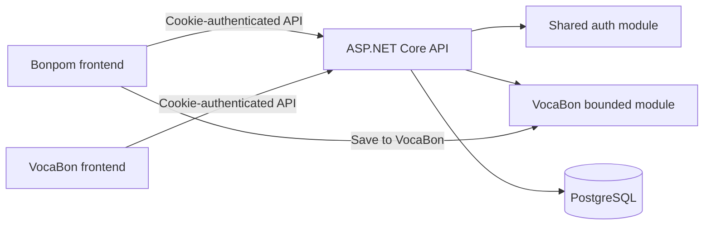

# VocaBon Implementation Plan

## 1. Product Direction

**VocaBon** is a multilingual personal vocabulary application for collecting and reviewing words from any language. The first supported language choices should include Japanese (`ja`), French (`fr`), Spanish (`es`), and Polish (`pl`), without restricting the data model to those languages.

Bonpom remains a Japanese-focused learning application. It can send words to VocaBon, but neither product should require the other to function.

Recommended positioning:

> **VocaBon**  
> Your words, any language.

### Product boundaries

| Product | Responsibility |
| --- | --- |
| **VocaBon** | Personal multilingual vocabulary, organization, search, and later review tools |
| **Bonpom** | Japanese study, WaniKani content, grammar, and reading practice |
| **Shared platform** | User identity, authentication, vocabulary API, and account settings |

## 2. Goals and Non-Goals

### MVP goals

- Create a vocabulary entry with a term, translation, source language, and translation language.
- List, search, filter, edit, archive, and delete the current user's entries.
- Remember the user's most recent language pair for quick entry.
- Support Unicode correctly across Japanese, French, Spanish, Polish, and future languages.
- Use the same user account as Bonpom.
- Allow Bonpom users to save a Japanese word into VocaBon.
- Deliver a responsive web experience for phone and desktop.
- Make VocaBon independently deployable from Bonpom.

### Explicit non-goals for the MVP

- Automatic translation.
- Speech recognition or generated audio.
- Full spaced-repetition scheduling.
- Public/shared vocabulary lists.
- Language-specific grammar models.
- Native mobile applications.
- A separate identity service or independently deployed vocabulary backend.

These features can be added after real vocabulary-entry and review behavior is understood.

## 3. Recommended Architecture

Use a **separate frontend application with a shared backend** initially.



### Repository layout

Add an independently buildable frontend at the repository root:

```text
WaniKani.Relearn/
├── VocaBon.FE/                  # New React Router application
├── WaniKani.Relearn.FE/         # Existing Bonpom frontend
├── WaniKani.Relearn/            # Shared ASP.NET Core API
│   └── Vocabulary/              # New bounded backend feature
└── BonPom.Tests/                # Backend tests, including VocaBon tests
```

Keep VocaBon in the monorepo at first so authentication contracts, API changes, and integration can evolve atomically. Give `VocaBon.FE` its own package, environment configuration, Dockerfile, and deployment pipeline so it can be extracted later without redesigning the product.

### Why not create a microservice now?

- The current backend already owns users and cookie authentication.
- Vocabulary entries require the same user identity.
- A separate service would immediately require service authentication, distributed deployment, and cross-service consistency.
- A bounded `Vocabulary` module preserves an extraction boundary without introducing that operational cost.

Extract the module only if VocaBon later needs independent scaling, a separate team/release cadence, or integrations that no longer belong in the Bonpom API.

## 4. Domain and Authentication Strategy

### Phase 1 domain layout

- `bonpom.app` - Bonpom
- `vocabon.bonpom.app` - VocaBon
- `api.bonpom.app` - shared API

The frontends are separate applications, but sibling subdomains remain the same browser site. Both applications call the shared API with `credentials: "include"`.

Required backend changes:

- Add both exact frontend origins to `AllowedCorsOrigins`.
- Keep the authentication cookie `HttpOnly` and `Secure`.
- Use `/api/auth/me` as the source of client authentication state.
- Do not make VocaBon depend on the JavaScript-readable `X-User-Claims` cookie.
- Add CSRF protection or strict origin validation to cookie-authenticated mutation endpoints.
- Keep every vocabulary query scoped to `ClaimTypes.NameIdentifier`.

The existing API already creates a stable user ID claim and uses that pattern in authenticated Bonpom endpoints. VocaBon should follow the same ownership model.

### Independent `vocabon.app` domain

Cookies cannot be shared between `bonpom.app` and `vocabon.app`. If VocaBon later moves to its own apex domain, introduce standards-based single sign-on:

1. Create or adopt an OpenID Connect provider.
2. Use Authorization Code Flow with PKCE.
3. Give each frontend its own client registration and callback URLs.
4. Keep API authorization based on a stable shared subject/user identifier.
5. Migrate both products before changing the production VocaBon domain.

Do not attempt to stretch the current cookie across unrelated domains.

## 5. Core Data Model

The MVP represents one personal vocabulary library per user. Lists/decks can be added later without complicating word capture now.

### `VocabularyEntryEntity`

| Field | Type | Rules |
| --- | --- | --- |
| `Id` | UUID/Guid v7 | Primary key |
| `UserId` | string | Required FK to `users.id`; always taken from auth claims |
| `Term` | string | Required; maximum 256 characters |
| `TermLanguageTag` | string | Required BCP 47 tag; maximum 35 characters |
| `Translation` | string | Required; maximum 512 characters |
| `TranslationLanguageTag` | string | Required BCP 47 tag; maximum 35 characters |
| `Notes` | string? | Optional; maximum 2,000 characters |
| `SourceType` | string | `manual`, `bonpom`, or future integration identifier |
| `SourceReference` | string? | Optional external ID, such as a Bonpom subject ID |
| `CreatedAt` | timestamp | UTC, server generated |
| `UpdatedAt` | timestamp | UTC, server updated |
| `ArchivedAt` | timestamp? | Soft archive for normal removal |

Suggested indexes:

- `(user_id, created_at DESC)` for the default list.
- `(user_id, term_language_tag, translation_language_tag)` for language-pair filtering.
- `(user_id, source_type, source_reference)` for integration lookup and idempotency.

Do not make `Term` unique. Homographs and intentionally duplicated words can have different meanings or learning contexts.

### Language representation

- Store BCP 47 language tags such as `fr`, `es`, `pl`, `ja`, and `en`.
- Validate syntax on the API, but do not use a database enum or a four-language allowlist.
- Present common languages first in the UI while retaining a searchable language selector.
- Store the user's recent source and translation language tags in local preferences first; move them to account settings only when cross-device preference sync is needed.
- Never use national flags as the only language indicator.

### Future entities

Add these only after the MVP:

- `VocabularyListEntity` and `VocabularyListEntryEntity` for custom decks.
- `VocabularyExampleEntity` for example sentences.
- `VocabularyReviewStateEntity` for spaced repetition.
- `VocabularyTranslationEntity` if one term needs structured translations in several target languages.

## 6. Backend Module

Create `WaniKani.Relearn/Vocabulary/` following the repository's existing feature-registration style.

```text
Vocabulary/
├── ServiceCollectionExtensions.cs
├── Api/
│   ├── VocabularyEntriesController.cs
│   ├── CreateVocabularyEntryRequest.cs
│   └── UpdateVocabularyEntryRequest.cs
├── Data/
│   ├── IVocabularyEntryService.cs
│   └── VocabularyEntryService.cs
└── Models/
    └── VocabularyEntry.cs
```

Register the feature from `Program.cs` with an `AddVocabularyApi()` extension. Add the EF entity and mapping to `BonpomDbContext`. Use a versioned PostgreSQL migration script under the existing `Data/SqlScripts` convention unless the repository formally adopts EF migrations first.

### API endpoints

| Method | Route | Purpose |
| --- | --- | --- |
| `GET` | `/api/vocabulary-entries` | Paginated current-user list with query and language filters |
| `GET` | `/api/vocabulary-entries/{id}` | Get one current-user entry |
| `POST` | `/api/vocabulary-entries` | Create an entry |
| `PATCH` | `/api/vocabulary-entries/{id}` | Update editable fields |
| `DELETE` | `/api/vocabulary-entries/{id}` | Archive an entry |

Example create request:

```json
{
  "term": "bonjour",
  "termLanguageTag": "fr",
  "translation": "hello",
  "translationLanguageTag": "en",
  "notes": null,
  "sourceType": "manual",
  "sourceReference": null
}
```

### API behavior

- Require authentication on all endpoints.
- Derive `UserId` from `ClaimTypes.NameIdentifier`; never accept it from request JSON.
- Return `201 Created` with a location for successful creation.
- Return `404` when an entry does not exist **or belongs to another user**.
- Validate required text, maximum lengths, and BCP 47 language-tag syntax.
- Trim text while preserving Unicode and diacritics.
- Use cursor or stable page-number pagination from the start; never return an unbounded library.
- Support cancellation tokens through controller, service, and EF calls.
- Log entry IDs and operation outcomes, but not vocabulary text by default.

## 7. VocaBon Frontend

Create `VocaBon.FE` using the same React Router and TypeScript versions as Bonpom initially. Share concepts and API contracts, but avoid importing source files directly from `WaniKani.Relearn.FE` until a deliberate shared UI package exists.

### MVP routes

| Route | View |
| --- | --- |
| `/` | Vocabulary library with search and language-pair filter |
| `/new` | Fast two-text-field word entry with language selectors |
| `/entries/:id/edit` | Edit an entry |
| `/login` | Shared-account login flow |
| `/settings` | Account, preferred language pair, and Bonpom connection |

### New-entry experience

- Make term and translation the dominant controls.
- Place compact source and translation language selectors above their corresponding fields.
- Remember and preselect the last language pair.
- Allow keyboard submission.
- Return focus to the term field after a successful save for rapid entry.
- Show a clear inline success state and an undo/archive action.
- Keep optional notes collapsed or secondary.
- Use neutral multilingual branding rather than Japanese-specific symbols.

### Library experience

- Default to newest entries first.
- Search both term and translation.
- Filter by source language and translation language.
- Provide edit and archive actions without requiring a detail page.
- Preserve filters in URL query parameters.
- Include loading, empty, offline, validation-error, unauthorized, and server-error states.

### Local persistence

The current Bonpom prototype stores entries under `bonpom-custom-vocabulary` in `localStorage`. Treat this as prototype data, not the production source of truth.

Add a one-time import flow in VocaBon:

1. Detect the legacy key when VocaBon is hosted under a domain that can access it, or export it from Bonpom when cross-origin access is impossible.
2. Show the number of detected entries.
3. Ask the user to confirm language tags before import.
4. POST entries to the API with an idempotency key or duplicate preview.
5. Mark migration complete without deleting the source automatically.

## 8. Bonpom Integration

Bonpom should remain useful without VocaBon, while making word capture nearly effortless.

### Required Bonpom changes

- Replace the current prototype-only creation route with a VocaBon integration entry point once the VocaBon API is live.
- Add **Save to VocaBon** on vocabulary subject details and previews.
- Pre-fill:
  - `Term` from subject characters.
  - `TermLanguageTag` as `ja`.
  - `Translation` from the primary meaning.
  - The user's recent target language, falling back to `en` only when no preference exists.
  - `SourceType` as `bonpom`.
  - `SourceReference` as the Bonpom subject ID.
- Show `Saved`, `Open in VocaBon`, and retry states.
- Prevent accidental duplicate saves for the same user and Bonpom subject while still allowing the user to edit the resulting entry.

### Integration approach

For the MVP, Bonpom should call the shared vocabulary API directly. Avoid browser-to-browser communication or a custom webhook. Both applications use the same authenticated API and data ownership rules.

## 9. Delivery Phases

### Phase 0: Product and infrastructure decisions

- Confirm the `VocaBon` spelling and visual identity.
- Check relevant domains, app stores, social handles, and trademarks.
- Choose the initial host: `vocabon.bonpom.app` is recommended.
- Confirm the API host and CORS origin list.
- Decide the default/fallback translation language without hardcoding the product to English.

**Exit criterion:** URLs, authentication topology, and MVP scope are approved.

### Phase 1: Backend foundation

- Add the vocabulary entity, mapping, and migration script.
- Add request/response contracts and validation.
- Implement authenticated CRUD and pagination.
- Add authorization, service, and controller tests.
- Document the endpoints in OpenAPI.

**Exit criterion:** One authenticated user can CRUD entries and cannot access another user's entries.

### Phase 2: Standalone VocaBon frontend

- Scaffold `VocaBon.FE` with independent build and environment configuration.
- Implement auth-state loading through `/api/auth/me`.
- Build new-entry, library, search/filter, edit, and archive experiences.
- Add responsive and accessible states.
- Add API client tests and critical component tests.

**Exit criterion:** A user can manage a multilingual library on phone and desktop without Bonpom.

### Phase 3: Bonpom integration

- Add VocaBon endpoints to Bonpom's API configuration.
- Add **Save to VocaBon** to Japanese vocabulary surfaces.
- Implement source-reference idempotency.
- Replace or retire the local-only Bonpom creation prototype.
- Add legacy local-data import/export support.

**Exit criterion:** A Bonpom word can be saved once, edited in VocaBon, and reopened from Bonpom.

### Phase 4: Deployment and observability

- Add VocaBon Docker and CI builds.
- Deploy the frontend and update exact CORS origins.
- Add structured metrics for create failures, API latency, and unauthorized responses.
- Add database backup/restore verification.
- Run desktop and mobile end-to-end smoke tests in production-like HTTPS.

**Exit criterion:** VocaBon is independently deployable and production monitoring covers its critical path.

### Phase 5: Learning features

Prioritize based on observed use:

- Custom lists/decks.
- Review sessions and spaced repetition.
- Examples, notes, pronunciation, and grammatical metadata.
- CSV/JSON import and export.
- Browser extension or share-sheet capture.
- Offline-first PWA support.
- Independent `vocabon.app` domain with OpenID Connect SSO.

## 10. Testing Strategy

### Backend

- Validation tests for empty/oversized values and malformed language tags.
- Ownership tests proving cross-user reads, updates, and deletes return `404`.
- CRUD and archive service tests against the database abstraction.
- Pagination and filter tests using diacritics and non-Latin scripts.
- Bonpom source-reference idempotency tests.
- Authentication tests for every endpoint.

### Frontend

- Form validation and successful submission tests.
- Last-language-pair preference tests.
- Search and URL-filter tests.
- Unauthorized and expired-session behavior.
- Keyboard-only and screen-reader label checks.
- Responsive screenshots at representative phone and desktop sizes.

### End to end

- Register/log in, add French, Spanish, Polish, and Japanese entries, then edit and archive them.
- Log in from both applications and confirm the same library is visible.
- Save a Bonpom Japanese subject and confirm its source metadata in VocaBon.
- Verify one user cannot retrieve another user's entry by guessing an ID.

## 11. Security and Privacy Checklist

- Keep session cookies `HttpOnly`, `Secure`, and appropriately scoped.
- Use exact CORS origins with credentials; never combine credentials with wildcard origins.
- Protect state-changing routes from CSRF.
- Derive ownership exclusively from authenticated claims.
- Avoid logging terms, translations, notes, credentials, or session cookies.
- Rate-limit login, bulk import, and write endpoints.
- Encode output normally through React; never render vocabulary text as raw HTML.
- Provide account-data export and deletion before public launch.
- Document whether vocabulary content is included in backups and telemetry.

## 12. Definition of MVP Done

- VocaBon runs as a separate frontend deployment.
- A shared Bonpom account can authenticate in VocaBon.
- Entries support arbitrary valid language tags and Unicode text.
- Authenticated CRUD, pagination, filtering, and search work correctly.
- Ownership isolation is covered by automated tests.
- The UI works without overlap at phone and desktop widths.
- Bonpom can save a Japanese vocabulary subject to VocaBon idempotently.
- Prototype `localStorage` data has a documented migration path.
- OpenAPI, deployment configuration, monitoring, and backups are updated.

## 13. Decisions to Make Before Coding

1. Which translation language should be suggested for a brand-new user?
2. Should archive be recoverable in the MVP, or should the UI expose permanent deletion as well?
3. Should one term have one free-text translation initially, or should multiple meanings be first-class records?
4. Is `vocabon.bonpom.app` acceptable for the first release?
5. Should the existing prototype UI be reused visually, or should VocaBon establish a new multilingual design system?

The recommended defaults are: remember the user's selected target language, support recoverable archive only, use one free-text translation in the MVP, launch on `vocabon.bonpom.app`, and evolve the prototype into a language-neutral VocaBon identity.